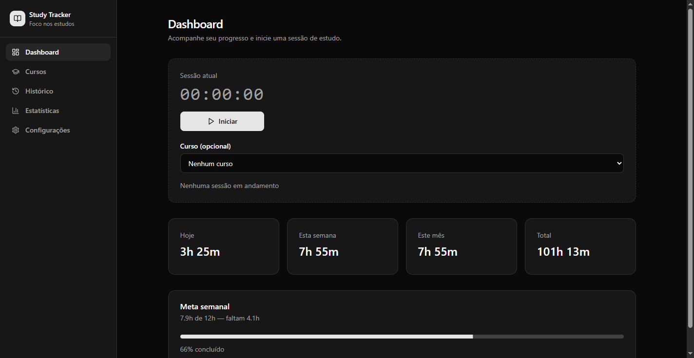
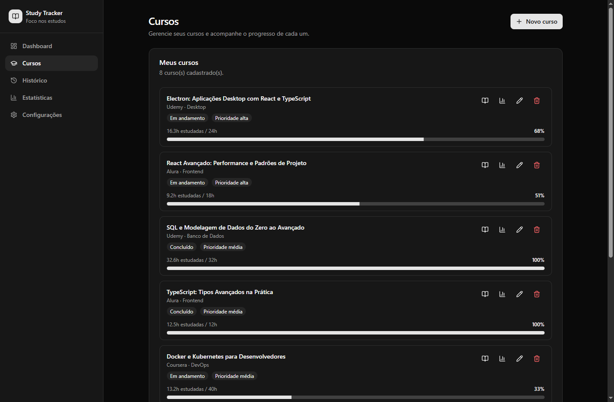
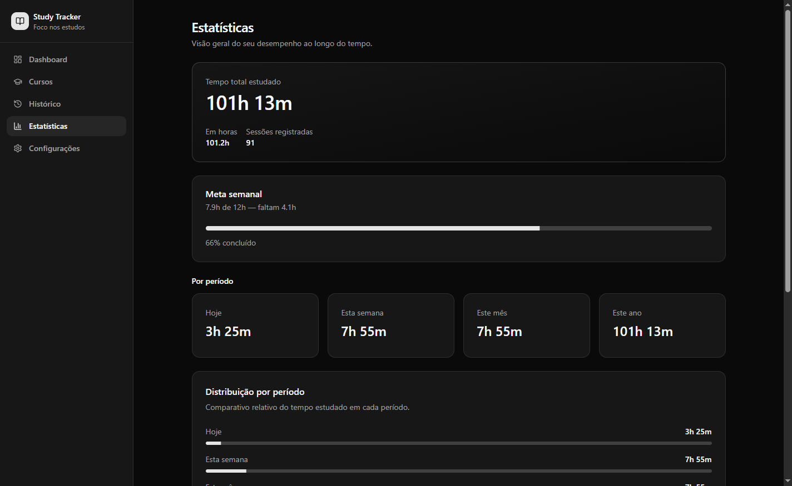

<div align="center">


# Study Tracker

**A privacy-first desktop app to track study hours, manage online courses and see real progress — no account, no cloud, no telemetry.**

[](https://www.electronjs.org/)
[](https://react.dev/)
[](https://www.typescriptlang.org/)
[](https://www.prisma.io/)
[](https://www.sqlite.org/)
[](https://tailwindcss.com/)
[](LICENSE)

**English** · [Português (BR)](README.pt-BR.md)

### [⬇️ Download for Windows](https://github.com/merino626/study-tracker/releases/download/v1.0.0/Study.Tracker-Setup-1.0.0.exe)

<sub>Version 1.0.0 · Windows 10/11 (x64) · ~126 MB installer · [all releases](https://github.com/merino626/study-tracker/releases/latest)</sub>

</div>

---

## Table of contents

- [Download](#download)
- [Screenshots](#screenshots)
- [Why I built this](#why-i-built-this)
- [Features](#features)
- [Tech stack](#tech-stack)
- [Architecture](#architecture)
- [Project structure](#project-structure)
- [Getting started](#getting-started)
- [Available scripts](#available-scripts)
- [Where your data lives](#where-your-data-lives)
- [Backup format](#backup-format)
- [Security model](#security-model)
- [Roadmap](#roadmap)
- [License](#license)

---

## Download

| Platform                | File                                                                                        | Download                                                                                                                    |
| ----------------------- | ------------------------------------------------------------------------------------------- | --------------------------------------------------------------------------------------------------------------------------- |
| **Windows 10/11 (x64)** | `Study Tracker-Setup-1.0.0.exe` — NSIS installer, ~126 MB                                   | **[⬇️ Direct download](https://github.com/merino626/study-tracker/releases/download/v1.0.0/Study.Tracker-Setup-1.0.0.exe)** |
| macOS / Linux           | `.dmg` / `.AppImage` targets are configured in `electron-builder.yml` but not published yet | [Build it yourself](#production-build)                                                                                      |

Release notes: **[v1.0.0](https://github.com/merino626/study-tracker/releases/tag/v1.0.0)** · every version: [releases page](https://github.com/merino626/study-tracker/releases/latest)

> The installer is unsigned (no paid code-signing certificate), so Windows SmartScreen may show a
> _"Windows protected your PC"_ warning. Click **More info → Run anyway**, or build from source with
> `npm run build:win`.

Installer options: choose the install directory, desktop shortcut and Start Menu shortcut.

---

## Screenshots

<!--
  Add your screenshots to docs/screenshots/ and uncomment the block below.
  Suggested captures: dashboard.png, timer-compact.png, courses.png,
  course-detail.png, statistics.png, settings.png

| Dashboard | Compact timer |
|-----------|---------------|
|  |  |

| Courses | Statistics |
|---------|------------|
|  |  |
-->

_Screenshots coming soon — drop your PNGs in [`docs/screenshots/`](docs/screenshots/) and uncomment the gallery in this file._

---

## Why I built this

Most study-tracking tools are web apps that require an account, live behind a paywall, or quietly send
your data somewhere. I wanted something that:

- **starts a timer in one click** and gets out of the way while I study;
- **connects every logged minute to an actual course**, so I can tell how far along I really am;
- **keeps 100% of the data on my own machine**, in a plain SQLite file I can copy anywhere;
- **never loses anything** — checksummed ZIP backups, automatic and restorable.

It is also an end-to-end showcase of a production-shaped Electron application: a fully typed IPC
contract, double validation with Zod, a hand-rolled idempotent migration runner, and a checksum-verified
backup subsystem.

---

## Features

### ⏱️ Study timer with compact mode

- One-click start / pause / finish. Elapsed time is persisted to `localStorage` on every tick, so an
  accidental crash or close never loses the session in progress.
- When the timer starts, the window **animates down to a 340×160 px widget** pinned to the bottom-right
  corner of the screen, so it stays visible without covering the material you are studying.
- Optional _always on top_, so the widget floats over your browser or video player.
- Sessions can be attached to a course at start time; the last chosen course is remembered.

### 📚 Course management

- Full CRUD with name, platform (Udemy, Alura, Coursera, YouTube, LinkedIn Learning, Pluralsight,
  Domestika, other), URL, instructor, category, official hours and start / completion dates.
- **Status** (not started · in progress · completed · paused) and **priority** (low · medium · high).
- Personal rating, free-form tags (stored as a JSON array) and Markdown notes.
- **Per-course statistics**: hours studied, completion percentage against the official duration,
  average session length, last session, time since last activity and the full session history.
- Deleting a course never deletes your history — linked sessions simply lose the course reference
  (`onDelete: SetNull`).

### 📓 Course notebook & attachments

- A multi-note notebook per course, each note with its own title and free-form content.
- File attachments (up to 25 MB each) linked to a course or to a specific note. Files are copied into
  the application's private storage directory, with sanitized names and a generated storage key.
- Attachments can be previewed inside the app or opened with the operating system's default program.

### 📊 Dashboard & statistics

- Today / this week / this month / this year totals, computed live from the session table.
- Weekly-goal progress bar with a configurable target (default: 20 h/week).
- Insight cards: overall averages, longest session, number of days studied, per-period breakdown.
- Hours studied are **never denormalized** — they are always aggregated from real sessions, so the
  numbers cannot drift out of sync.

### 🗂️ History

- Chronological list of every session, with inline editing (start, end, duration, linked course) and a
  confirmation dialog before deletion.

### 💾 Backup & restore

- Backups are **ZIP archives containing JSON**, plus a `manifest.json` with a SHA-256 checksum per file.
- Four triggers: manual, automatic daily, on app quit (opt-in) and **always before a schema migration**.
- Restore is a guided flow: validate checksums → preview record counts → choose which modules
  (sessions, courses, settings) to restore.
- The 50 most recent backups are kept; older ones are pruned automatically.

### 🎨 Interface

- Light / dark / system theme via `next-themes`.
- Built on shadcn/ui + Radix primitives, so dialogs, switches and tooltips are accessible by default.
- Optional _launch on Windows startup_.

---

## Tech stack

| Layer         | Technology                                                                              |
| ------------- | --------------------------------------------------------------------------------------- |
| Desktop shell | **Electron 37** (main / preload / renderer split)                                       |
| UI            | **React 19**, **TypeScript 5.8**, **Tailwind CSS 4**, shadcn/ui, Radix UI, lucide-react |
| Client state  | **Zustand** (timer, compact mode, course selection)                                     |
| Routing       | React Router 7 (`HashRouter`, required under the `file://` protocol)                    |
| Database      | **SQLite** through **Prisma ORM 6**                                                     |
| Validation    | **Zod** schemas shared between renderer and main process                                |
| Dates         | date-fns                                                                                |
| Backup        | adm-zip + SHA-256 checksums                                                             |
| Build         | **Vite 7**, vite-plugin-electron, **electron-builder** (NSIS / DMG / AppImage)          |
| Quality       | ESLint 9 (flat config), Prettier 3 + prettier-plugin-tailwindcss, `tsc --noEmit`        |

---

## Architecture

The renderer process **never** touches Node.js, `fs`, `electron` or Prisma. Every operation goes through
a narrow, fully typed bridge exposed by the preload script.

```
                        USER
                          │
                  ┌───────▼────────┐
                  │  React (UI)    │   pages · components · hooks · Zustand stores
                  └───────┬────────┘
                          │ window.api.*        (typed StudyTrackerApi contract)
                  ┌───────▼────────┐
                  │    Preload     │   the only authorized bridge (contextBridge)
                  └───────┬────────┘
                          │ ipcRenderer.invoke('domain:action')
                  ┌───────▼────────┐
                  │  IPC handlers  │   Zod validation → business logic
                  │   + Prisma     │
                  └───────┬────────┘
             ┌────────────┼─────────────┐
             ▼            ▼             ▼
        SQLite file   Backup ZIP    OS integration
        (Prisma)      (JSON+hash)   (window, dialogs, startup)
```

### Startup sequence

```
electron/main/index.ts
   ├── setupAppLifecycle()             → error handlers, quit hooks
   └── initializeApp()
         ├── app.whenReady()
         ├── registerAllIpcHandlers()  → wire up every 'domain:action' channel
         ├── initializeDatabase()
         │      ├── applyMigrations()  → custom idempotent runner
         │      └── upsert default settings
         ├── syncSettingsEffects()     → always-on-top, launch on startup
         ├── runDailyBackupIfNeeded()
         └── createMainWindow()
```

### IPC channel naming

Channels follow a `domain:action` convention and are declared once, as a single const object, in
[`shared/types/ipc-channels.ts`](shared/types/ipc-channels.ts):

| Domain              | Channels                                                                 |
| ------------------- | ------------------------------------------------------------------------ |
| `session`           | `create`, `update`, `delete`, `list`                                     |
| `course`            | `create`, `update`, `delete`, `list`, `get`, `stats`                     |
| `course-note`       | `list`, `create`, `update`, `delete`                                     |
| `course-attachment` | `list`, `add`, `delete`, `read`, `open`                                  |
| `backup`            | `create`, `list`, `validate`, `preview`, `restore`, `pick-file`          |
| `settings`          | `get`, `update`, `pick-backup-folder`                                    |
| `stats`             | `get`                                                                    |
| `window`            | `enter-compact`, `exit-compact`, `set-always-on-top`, `get-compact-mode` |

### Double validation

The same Zod schemas in [`shared/schemas/`](shared/schemas/) run **twice** — in the form before sending,
and again inside the handler before anything touches the database. The renderer is treated as untrusted
input, exactly as a browser client would be.

### Migrations

The app deliberately does **not** run `prisma migrate` at runtime. A small custom runner in
[`electron/main/migrations.ts`](electron/main/migrations.ts) tracks applied files in a
`_study_tracker_migrations` table, applies pending SQL in order, tolerates "column already exists"
errors (idempotent) and takes a backup before running anything.

📖 **A full, illustrated architecture document (in Portuguese) lives at
[`docs/ARQUITETURA.md`](docs/ARQUITETURA.md)** — 500+ lines covering every flow, diagram and design
decision.

---

## Project structure

```
study-tracker/
├── electron/                   # MAIN PROCESS (Node.js side)
│   ├── main/
│   │   ├── index.ts            # entry point
│   │   ├── app.ts              # lifecycle, error handling
│   │   ├── database.ts         # Prisma connection + db path resolution
│   │   ├── migrations.ts       # custom idempotent migration runner
│   │   ├── backup.ts           # create / validate / restore ZIP backups
│   │   ├── attachments.ts      # file storage, sanitizing, 25 MB limit
│   │   ├── paths.ts            # dev vs packaged path resolution
│   │   ├── prisma-client.ts    # loads Prisma inside the Electron bundle
│   │   └── sqlite-introspection.ts
│   ├── ipc/
│   │   ├── index.ts            # registers every handler
│   │   ├── validate.ts         # Zod validation + error wrapping
│   │   └── handlers/           # one file per domain
│   ├── preload/index.ts        # contextBridge → window.api
│   └── windows/main-window.ts  # main window + compact-mode animation
│
├── src/                        # RENDERER (React)
│   ├── pages/                  # Dashboard, Courses, CourseDetail, History, Statistics, Settings
│   ├── components/             # courses/ dashboard/ history/ layout/ settings/ statistics/ timer/ ui/
│   ├── hooks/                  # useSessions, useCourses, useStats, useTimer, useBackup, …
│   ├── stores/                 # Zustand: timer, compact mode, course selection
│   ├── layouts/                # MainLayout, CompactLayout
│   ├── services/ipc-client.ts  # typed client over window.api
│   └── lib/, utils/
│
├── shared/                     # SHARED BY BOTH PROCESSES
│   ├── types/models.ts         # domain models + StudyTrackerApi contract
│   ├── types/ipc-channels.ts   # channel names
│   ├── schemas/                # Zod schemas
│   └── constants/              # statuses, platforms, window sizes, backup config
│
├── prisma/
│   ├── schema.prisma           # StudySession, Course, CourseNote, CourseAttachment, AppSettings
│   └── migrations/             # raw SQL migrations
│
├── docs/ARQUITETURA.md         # full architecture documentation (PT-BR)
├── build/icon.png              # app icon used by electron-builder
└── electron-builder.yml        # packaging config (NSIS / DMG / AppImage)
```

---

## Getting started

### Prerequisites

- **Node.js 20+** and npm
- Windows, macOS or Linux (development works on all three; only the Windows installer is published)

### Installation

```bash
git clone https://github.com/merino626/study-tracker.git
cd study-tracker
npm install            # postinstall runs `prisma generate` automatically
cp .env.example .env   # on Windows: copy .env.example .env
```

`.env` only holds the SQLite path used during development:

```env
DATABASE_URL="file:../database/study-tracker.db"
```

### Development

```bash
npm run dev
```

Vite serves the renderer on `http://localhost:5173` and Electron loads it with hot reload. The database
file is created automatically at `database/study-tracker.db` on first run, and migrations are applied
at startup.

### Production build

```bash
npm run build:win     # Windows installer (NSIS) → release/
npm run build         # current platform
```

The pipeline runs `prisma generate` → `vite build` (renderer + main + preload) → `electron-builder`.
The resulting installer is `release/Study Tracker-Setup-<version>.exe`.

> **Packaging note:** Prisma's native `.node` query engines must stay outside the asar archive, so
> `node_modules/.prisma` and `@prisma/client` are declared under `asarUnpack`, and the SQL migrations
> ship through `extraResources` — that is what makes migrations work in the installed app.

---

## Available scripts

| Script                   | What it does                                         |
| ------------------------ | ---------------------------------------------------- |
| `npm run dev`            | Vite dev server + Electron with hot reload           |
| `npm run build`          | Full production build for the current platform       |
| `npm run build:win`      | Windows NSIS installer                               |
| `npm run build:renderer` | Renderer-only build                                  |
| `npm run preview`        | Preview the built renderer in a browser              |
| `npm run typecheck`      | `tsc --noEmit` across renderer, main and shared code |
| `npm run lint`           | ESLint 9 (flat config)                               |
| `npm run format`         | Prettier + Tailwind class sorting                    |
| `npm run format:check`   | Verify formatting without writing                    |

---

## Where your data lives

| Environment                 | Database                                   | Attachments                                   |
| --------------------------- | ------------------------------------------ | --------------------------------------------- |
| Development (`npm run dev`) | `database/study-tracker.db`                | `database/course-attachments/`                |
| Installed app               | `%APPDATA%/study-tracker/study-tracker.db` | `%APPDATA%/study-tracker/course-attachments/` |

Nothing ever leaves the machine: there is no account, no server, no analytics and no network request in
the entire codebase. To move your data to another computer, copy the `.db` file — or, better, use a
backup ZIP.

---

## Backup format

```
backup-2026-07-07-18-30-15.zip
├── manifest.json      # format version, timestamp, SHA-256 checksum per file
├── sessions.json      # every study session
├── courses.json       # every course
├── settings.json      # app settings
└── categories.json    # unique categories extracted from the courses
```

Because the payload is plain JSON, a backup doubles as a portable export you can read, diff or process
with any tool.

---

## Security model

| Setting            | Value        | Why                                                        |
| ------------------ | ------------ | ---------------------------------------------------------- |
| `contextIsolation` | `true`       | The renderer's JS context is isolated from the preload's   |
| `nodeIntegration`  | `false`      | React code has no access to `fs`, `child_process`, etc.    |
| `sandbox`          | `true`       | The renderer runs inside the OS sandbox                    |
| `contextBridge`    | preload only | Exposes an explicit allowlist of functions as `window.api` |

Every IPC payload is re-validated with Zod inside the main process, and attachment file names are
sanitized before they reach the filesystem.

---

## Roadmap

- [ ] Publish macOS (`.dmg`) and Linux (`.AppImage`) builds
- [ ] Code-signed Windows installer to remove the SmartScreen warning
- [ ] Auto-update through electron-updater
- [ ] Charts on the statistics page (weekly / monthly trend lines)
- [ ] CSV export alongside the ZIP backup
- [ ] Automated tests (Vitest + Playwright for the Electron shell)

---

## License

Released under the [MIT License](LICENSE) — © 2026 Luis Eduardo.

<div align="center">

Built with ☕ and too many unfinished Udemy courses.

</div>
